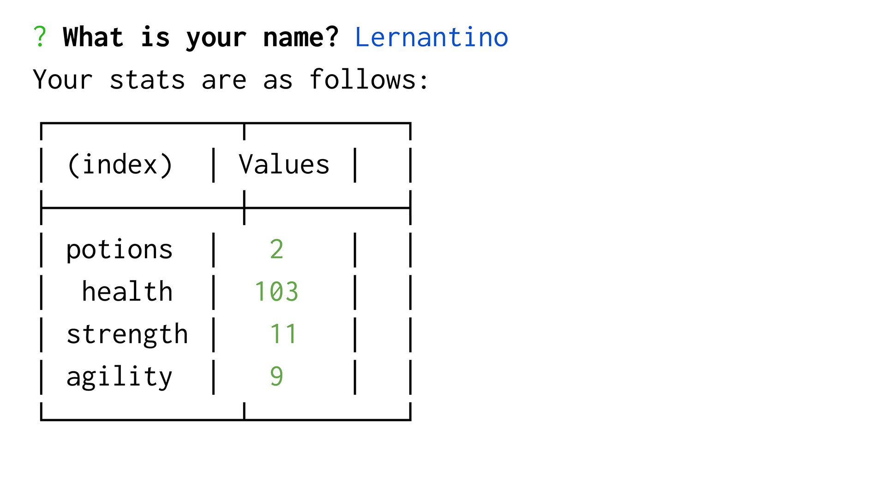

### Jest Another RPG

## Description
A simple, text-based RPG created as an introduction to Node.js, test-driven development, and object-oriented programming. A command-line role-playing game (RPG) in which the user battles a series of enemies whose health and stats can be sustained by taking a potion. The game creates new objects using JavaScript constructor functions, and also implements basic code tests using the Jest framework.

## Table of Contents
* [Instructions](#Instructions)
* [Tools](#tools)
* [Mock Up](#Mock-Up)

### Instructions
1. Run tests using command line: 'npm run test'
2. After installing the required packages, use the command line to navigate to the root of the application and run `node app`.  Follow prompts to enter player name and play the RPG. 

### Tools
* JavaScript
* Node.js
* [Inquirer Package](https://www.npmjs.com/package/inquirer)
* [Jest Package](https://www.npmjs.com/package/jest)

## Mock Up
The following image shows the web application's appearance:

